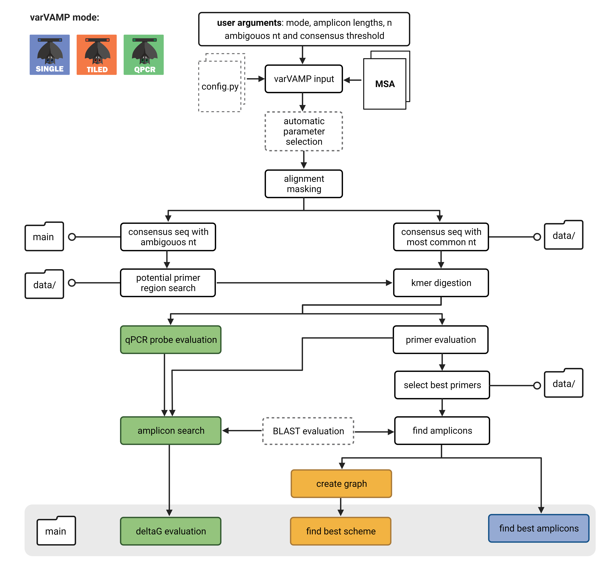

## How varVAMP works





### Automatic parameter selection
If no arguments for either threshold or number of ambiguous bases is given, varVAMP automatically estimates values so that roughly 50 % of the alignment can be considered for the primer design. If both values are not supllied, varVAMP allows 2 ambiguous nucleotides within the primer and optimizes the threshold. For the qPCR mode, varVAMP chooses 1 ambiguous base less in the probe compared to the primers if no value is given. This ensures a higher probe specificity and lower degeneracy than that of the primers.

### Alignment preprocessing
The alignment preprocessing contains three steps.
1. Convert RNA to DNA
2. Force nucleotides to lower charaters
3. Clean gaps. Larger insertions in single sequences enlarge the length of the alignment and therefore the length of amplicons will be overestimated. varVAMP masks regions it deletes with an "N" and knows now that it is not allowed to design primers spanning the potential insertion site.

### Consensus generation
varVAMP creates a consensus sequence based on a given threshold. If a nucleotide occurs with a frequency equal to or higher than the threshold in all aligned sequences, it is considered a consensus nucleotide. If not, the frequencies of the highest scoring nucleotides are added until the threshold is reached and the appropriate [ambiguous nucleotide character](https://www.bioinformatics.org/sms/iupac.html) is used. Importantly, varVAMP is aware of ambiguous nucleotides in the alignment and handels them by de-multiplexing the character into real nucleotides and adding its portion to the nucleotide counts at the alignment position.

### Primer region search
varVAMP searches for potential primer regions as defined by a user-defined number of ambiguous bases that is allowed within the minimal length of a primer. The algorithm opens windows over the ambiguous consensus sequence and determines if a window satisfies these constraints.

### Primer search
varVAMP uses [`primer3-py`](https://pypi.org/project/primer3-py/) to search for potential primers. Some of the evaluation process, determining if primers match certain criteria, was adapted from [`primalscheme`](https://github.com/aresti/primalscheme). The primer search contains multiple steps:
1. Digest the primer regions into kmers with the min and max length of primers. This is performed on a consensus sequence that does not contain ambiguous characters but is just the majority consensus of the alignment. Therefore, primer parameters will be later calculated for the best fitting primer.
2. Evaluate if these kmers are potential primers independent of their orientation (temperature, GC, size, poly-x repeats and poly dinucleotide repeats) and dependent on their orientation (secondary structure, GC clamp, number of GCs in the last 5 bases of the 3' end and min 3' nucleotides without an ambiguous base). Filter for kmers that satisfy all constraints and calculate their penalties (explained in the last section).
3. Single and tiled mode: Find primer with the lowest penalty. varVAMP sorts the primers by their penalty and always takes one with the lowest penalty if middle third of the primer has not been covered by a primer with a lower penalty. This greatly reduces the complexity of the later amplicon search while only retaining the best primer of a set of overlapping primers.

### Amplicon search

#### Amplicon-tiling
To search for the best amplicon, varVAMP uses a graph based approach.
1. Create all possible amplicons with the given length constraints and ensure that primer pairs are not forming dimers.
2. Create a graph containing all amplicons and their potential neighboring amplicons. To design a good scheme, the next primer has to lie within the second half of the current primer and satisfy the overlap constraint. The cost to go to a neighboring amplicon is determined by the amplicon penalty.
3. Use the [Dijkstra algorithm](https://en.wikipedia.org/wiki/Dijkstra%27s_algorithm) to find the path with the lowest costs from a given start node.
4. Determine potential stop nodes as amplicons with the furthest stop in the alignment.
5. Determine shortest paths between the start and all potential stop nodes. Get the lowest cost.
6. Repeat steps 3-5 for each start node until the best coverage is reached. Voila! We have the best amplicon scheme with the lowest cumulative primer penalties in respect to the amplicon length!
7. Lastly, the best scheme is evaluated for primer dimers in their respective pools. If a primer dimer pair is found, varVAMP evaluates for each primer their overlapping and previously not considered primers (primer search step 2) and again minimizes the penalty. The scheme and all primers are updated. If no alternative primers can be found, varVAMP issues a warning and reports the unsolvable primer dimers.

#### Single amplicons
1. varVAMP sorts all amplicons by their penalties and takes the non-overlapping amplicon with the lowest penalty!
2. As varVAMP gives a size penalty to amplicons, varVAMP automatically finds amplicons with low primer penalties close to your optimal length (if possible).

#### primer BLAST module
1. varVAMP generates a fasta query and searches for possible hits with the same settings as [primer blast](https://bmcbioinformatics.biomedcentral.com/articles/10.1186/1471-2105-13-134).
2. For each amplicon varVAMP searches for off-targets, defined as hits in the db that are the maximum amplicons length multiplied by `BLAST_SIZE_MULTI` apart from each other.
3. SINGLE/qPCR mode: varVAMP first sorts amplicons if they generate a BLAST hit or not and then by penalty to avoid the selection of off-targets. TILED: Graph edges are defined as tuples (off-target: True/False, amplicon_penalty). For finding the path with the lowest costs, varVAMP first considers if an amplicon generates off-targets and then the amplicon penalty, thereby avoiding the selection of amplicons during the graph search that generate off-targets.
4. Reports if the scheme has amplicons with off-targets in the log, in the primers.tsv (single/tiled) and in the qpcr_design.tsv/qpcr_primer.tsv files.

#### qPCR
1. Find probe regions with their own number of ambiguous characters.
2. Digest and search for probes (with their own base parameter)
3. Find primers flanking a probe
4. Evaluate amplicon parameters
5. Decide for the best primer/probe combination
6. For amplicons with the same primer sets but different probes, decide for the lowest probe
7. Test amplicons for their [minimal free energy](https://en.wikipedia.org/wiki/Gibbs_free_energy) at their lowest primer temperature with [`seqfold`](https://github.com/Lattice-Automation/seqfold) and filter to avoid secondary structures. Amplicons with large potential deletions (>QAMPLICON_DEL_CUTOFF) will be ignored. Smaller deletions will be accepted.
8. Take the best qPCR schemes of overlapping schemes.

#### Penalty calculation

```python
PRIMER_MAX_BASE_PENALTY
```
Each primer is penalized for its deviation from the optimal size, GC content and temperature. Base penalty is the sum of these deviations. Primer base penalties higher than the max base penalty are excluded.

```python
PRIMER_3_PENALTY
```
Each position in the primer is penalized for mismatches in all sequences. If a 3' penalty is given the first in the tuple is multiplied with the frequency mismatch at the very 3' end. The next is multiplied with the -1 freq and so on. Increase penalty if you want to shift amplicons towards best 3' matching. Set the `PRIMER_3_PENALTY` to 0 if you do not care about 3' mismatches.

```python3
PRIMER_PERMUTATION_PENALTY
```
The number of permutations of a primer is multiplied by the penalty. For example 24 permutations and a penalty of 0.1 will yield a penalty of 2.4. Set `PRIMER_PERMUTATION_PENALTY` to 0 if you do not care about the number of permutations.

All penalties of a primer are summed up and yield a final penalty. The penalty for each amplicon is then the penalty of its LEFT + RIGHT primers multiplied by the fold increase of the amplicon length compared to the optional length. This insures that in the final scheme not only large amplicons are used.

#### [Previous: Wet lab protocol](./wet_lab_protocol.md)&emsp;&emsp;[Next: FAQ](./FAQ.md)
