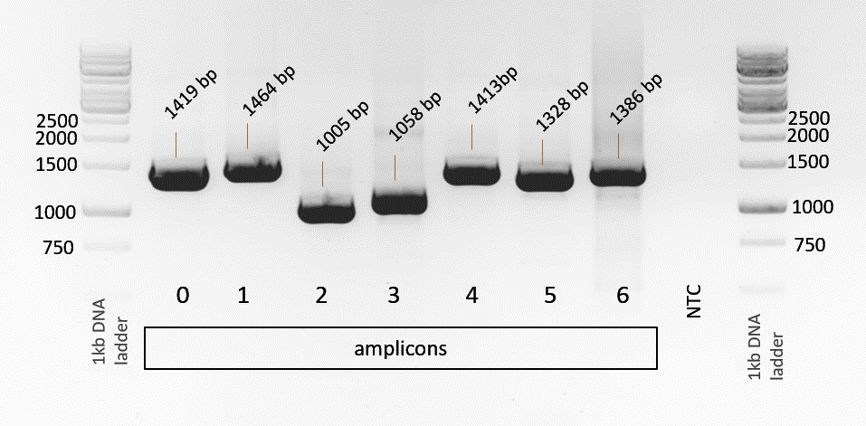
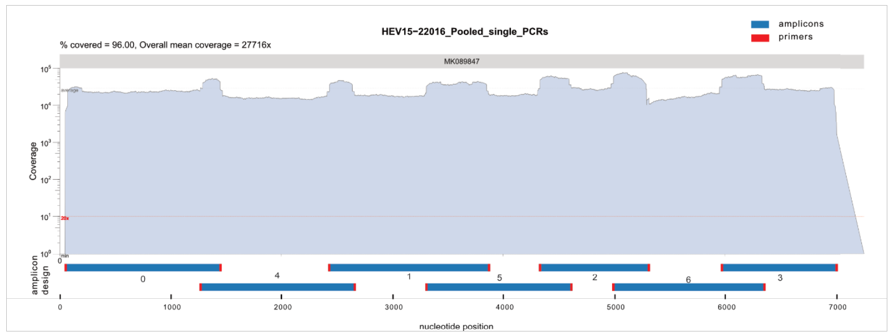

## RNA Isolation
The QIAmp Viral RNA Kit was used to isolate RNA out of viral supernatant following the manufacture's protocol. 

    • 560 µl prepared Buffer AVL (containing 5.6 µg carrier RNA)
    • 140 µl cell-culture supernatant
    • Incubate 10 min
    • 560 µl ethanol (100%)
    • 500 µl Buffer AW1
    • 500 µl Buffer AW2

    • Elute in 60 µl Buffer AVE

Thanks to Mathias Schemmerer for providing HepE infected cell cultures.

## Amplicon Generation by SuperScript-IV One-Step-PCR
The RNA amplification was performed with the following approach and PCR protocol for every single amplicon. 

PCR reaction:

    • 12,5 μL 	2X Platinum™ SuperFi™ RT-PCR Master Mix 
    • 0.25 μL	SuperScript™ IV RT Mix 
    • 0.75 µl	Nuclease-free water
    • 9.00 µl 	Template RNA (0.01 pg to 1 μg total RNA) 
    • 1.25 μl 	varVAMP´s forward primer (10 μM)
    • 1.25 μl 	varVAMP´s reverse primer (10 μM) 
    
    Total volume: 25 µl

PCR cycler program (Touchdown):

| Mode | Output | Description |
| --- | --- | --- |
55°C | 60 min | 1
98°C | 2 min | 1
98°C | 10s | 10
63°C (-0.5°C/cycle) | 10s | 10
72°C | 2 min | 10
98°C | 10s | 35
58°C | 10s | 35
72°C | 2 min | 35
72°C | 5 min | 1
4°C | ∞ | 1

**INFO:** Primers can also be used in two multiplex reactions.

## Results

Figure 1: The gel electrophoresis (1% agarose gel) indicated bands for all the single amplicons in the equivalent amplicon size of the design and no band for the negative control (NTC).

## Sequencing
After pooling the single PCR products of the seven amplicons the library preparation was performed with the NEBNext® Ultra™ II FS DNA Library Prep Kit for Illumina®.
Next generation sequencing was performed with an Ilumina MiSeq (2x150 bp).

### Results:

Figure 2: Coverage plot over the whole viral genome.

**IMPORTANT**: This protocol was established by Johanna Antonia Kleine as part of her M.D. thesis. Many thanks for your great work!

#### [Previous: Output](./output.md)&emsp;&emsp;[Next: How varVAMP works](./how_varvamp_works.md)
